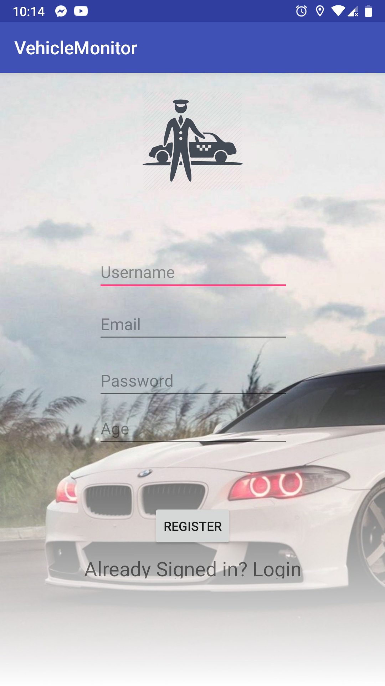
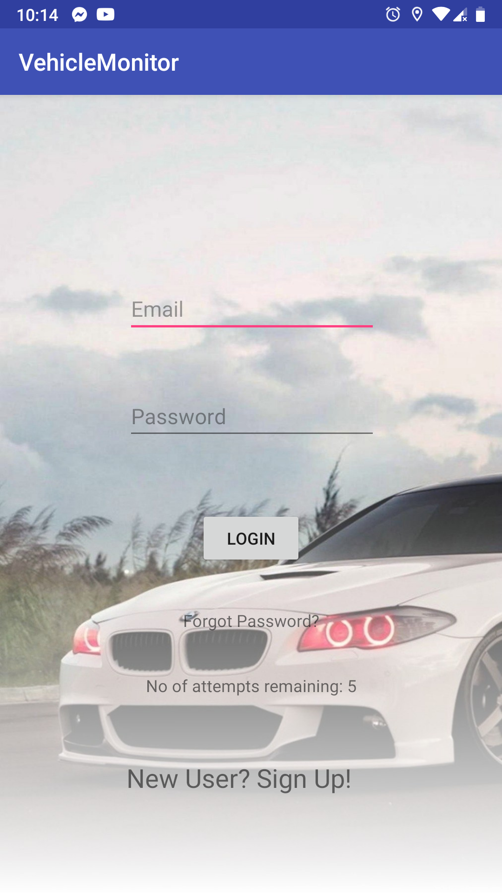
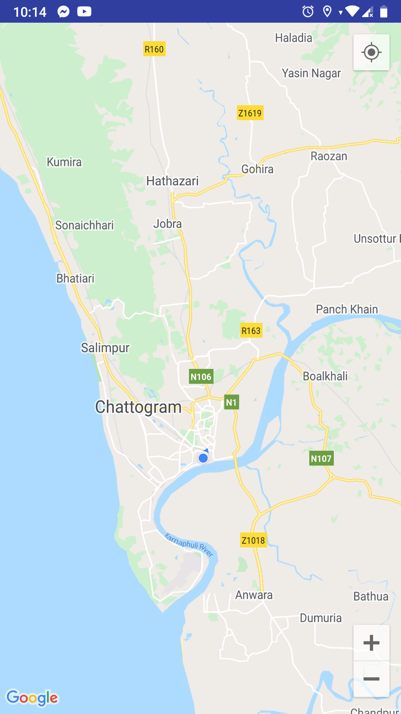

# Traffic Monitor App
### CSE 299 Junior Project Design (Fall 2018)
An Android app that helps traffic authorities detect speed limit violations in sensitive zones using GPS tracking.

<table>
  <tr>
    <td> Technology Uses </td>
    <td> Android Studio, Java</td>
  </tr>
</table>

### Pages

|        Registration      |        Login         |        Speed Meter         |        GPS         |
| :-------------------: | :-------------------: | :-------------------: | :-------------------: |
|  |  |  |  |

